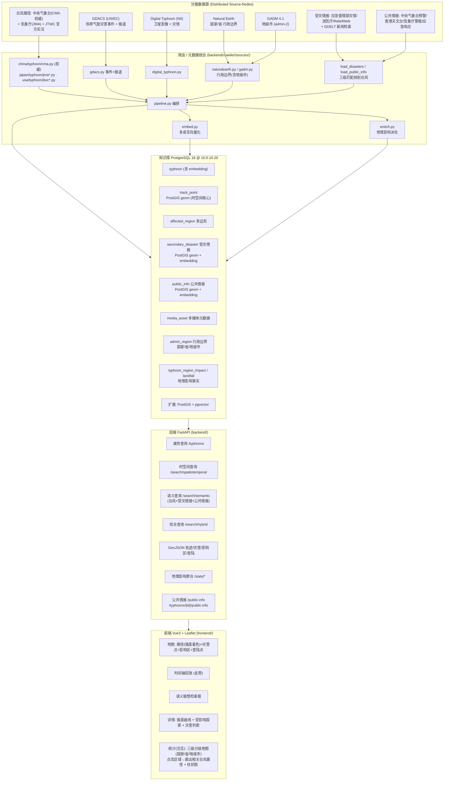
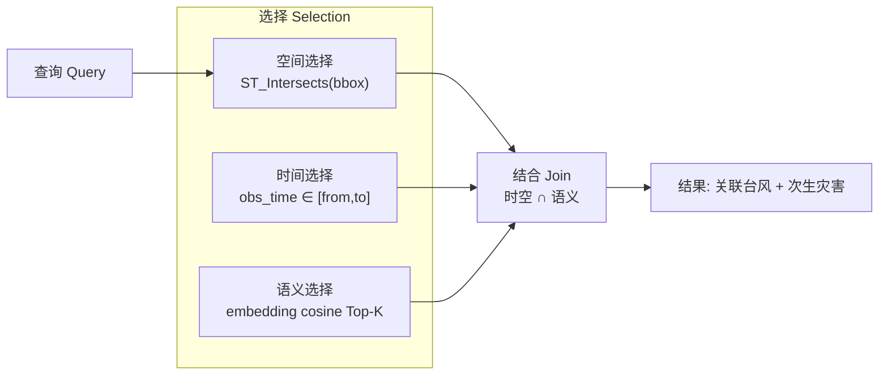

# 系统构成图 (System Architecture) — 报告 1-2 / S1-2

## 分散多媒体知识库 总体构成

## 三层计算模型 (对应课程「時間的·空間的·意味的 選択·結合」)

- **空间/时间** → PostGIS：`track_point.geom` 上的 GiST 索引 + `obs_time` B-tree。
- **语义** → pgvector：`typhoon.embedding` / `secondary_disaster.embedding` /
  `public_info.embedding` 上的 IVFFlat 余弦索引。
- **结合** → `/search/hybrid`：先时空过滤候选，再按语义距离排序，实现意味的结合检索。

### 语义选择的三个附加环节

纯 Top-K 余弦排序对本知识库不够用，`/search/semantic` 在其之上还做三件事：

1. **意图判定**（`services/intent.py`）——「2019」「2306」「Hagibis」是查找而非描述，
   余弦距离对「2019 这个年份」没有概念，因此改走结构化列查询。
2. **相关度阈值**（`DEFAULT_MAX_DISTANCE = 0.60`）——余弦距离没有下界，不设阈值时
   Top-K 永远返回 K 条。实测本库：有意义的查询上限约 0.55，无关查询下限约 0.75。
3. **关键词臂**——裸地名（「浙江」「甘肃」）的向量距离过不了阈值，即使库中存有含该
   字串的记录。故对短查询（≤2 词且 ≤16 字符）并行做子串匹配，其命中排在向量结果之前。
   长查询不触发：逐词 AND 会退化成词袋匹配。

三层知识（台风 / 受灾情报 / 公共情报）各自独立检索，结果分段返回。
