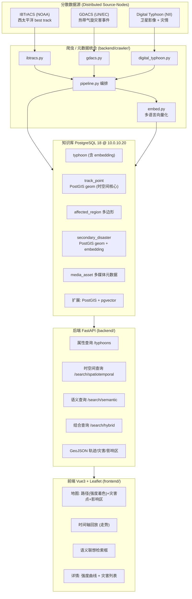
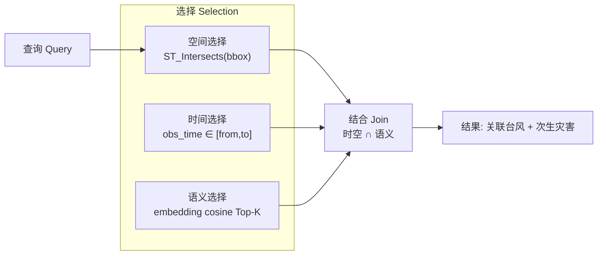

# 系统构成图 (System Architecture) — 报告 1-2 / S1-2

## 分散多媒体知识库 总体构成

## 三层计算模型 (对应课程「時間的·空間的·意味的 選択·結合」)

- **空间/时间** → PostGIS：`track_point.geom` 上的 GiST 索引 + `obs_time` B-tree。
- **语义** → pgvector：`typhoon.embedding` / `secondary_disaster.embedding` 上的 IVFFlat 余弦索引。
- **结合** → `/search/hybrid`：先时空过滤候选，再按语义距离排序，实现意味的结合检索。
