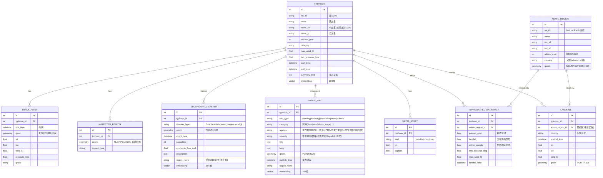

# 知识库数据结构定义 (Knowledge Base Data Structure) — 报告 1-3 / 1-4 / S1-1

以 SQLAlchemy ORM 数据库对象定义（见 `backend/models.py`），每张表兼具
**空间/时间特征列**（PostGIS `geom` + 时间戳）与**语义特征列**（pgvector `embedding`）。

## ER 关系

## 情报两层：受灾情报 vs 公共情报 (Damage vs Public Information)

台风相关的非结构文本情报按**语义角色**分成两张对等的知识单元表，各自带
PostGIS 几何 + pgvector 向量，都通过 `intl_id → 名称 → 时空邻近` 三级匹配挂到台风下
（`backend/crawler/load.py` 的 `_resolve_typhoon`）：

三级之间不是简单的降级重试，每一级都带约束，否则会把情报挂到错误的台风上：

- **名称匹配需要季节**。台风名循环复用（「Lola」出现在 17 个季节），只凭名字无法定位。
- **名称匹配需要空间校验**。同一季节里不同洋盆会有同名气旋（东太飓风 Dora 与西太台风
  Dora 同为 2023 年），故带坐标的记录还须落在轨迹附近。
- **中日文公报只以本地名指称台风**（`台风“巴威”`），因此 `Typhoon.name_cn` /
  `name_jp` 是这类情报唯一的匹配键 —— 中文名由 CMA 名单提供并写入。
- **指名却解析不出时不做猜测**。记录既然写明了台风，名字对不上就说明该气旋不在本库
  （多半属于其他洋盆），此时按时空「猜」一个最近的活跃台风只会制造错配。
- 只有**完全不指名**的记录（如中央气象台的县级预警）才允许纯按时空归属，且必须落在
  轨迹 4° 以内。

| 表 | 语义 | 来源 (`source`) | 载入函数 |
|---|---|---|---|
| `secondary_disaster` | **受灾情报** — *已发生的损失*（死伤 / 经济损失 / 洪涝·滑坡·风暴潮事件） | GDACS 事件、应急管理部灾情通报(MEM)、消防庁被害報(FDMA)、ReliefWeb | `load_disasters` |
| `public_info` | **公共情报** — *当局公开发布的信息*（预警·警报 / 避难·应急响应 / 报道） | 中央气象台预警(NMC)、香港天文台(HKO)、気象庁警報(JMA)、应急管理部应急响应、GDACS 报道 | `load_public_info` |

区分原则：**已发生的损失**入 `secondary_disaster`（`disaster_type`），**当局发布的信息**
入 `public_info`（`info_type` = warning/advisory/evacuation/news/bulletin）。同一机构可能
同时供给两层——例如 GDACS 的**事件**是受灾情报、其**报道页**是公共情报；应急管理部的
**灾情通报**是受灾情报、**应急响应公告**是公共情报。

> 检索：`/search/semantic` 现同时对台风 / 受灾情报 / 公共情报做 pgvector Top-K；
> `/public-info` 提供属性 + 时空(bbox/time)选择，`/typhoons/{id}/public-info` 按台风取。
> 已离线验证跨语言语义一致性：英文查询 "severe flooding and heavy rain warning"
> 命中中文「暴雨预警信号」余弦距离 ≈ **0.33**。

> 注意 pgvector 陷阱：IVFFlat 索引若在空表上由 `create_all` 建立会退化（查询返回 0 行），
> 故 `crawler/embed.py` 在每次向量回填后 `REINDEX` 三个向量索引；语义查询设
> `ivfflat.probes=10` 以保召回。

## 地理影响层 (Geographic Impact — 新增)

`ADMIN_REGION` 是参考行政边界，分三级（`admin_level` = 0 国家 / 1 省 / 2 地级市）：
- **国家 + 省**：**Natural Earth (public domain)**，`backend/crawler/sources/naturalearth.py`。
- **地级市（admin-2）**：**GADM 4.1（学术用途）**，`backend/crawler/sources/gadm.py`——中国 368 个地级市
  （含省份 `parent_name` 与中文名）+ 周边国家的二级行政区。
两者都经 `load.load_admin_regions` 幂等入库（按 `ne_id`）。

`backend/crawler/enrich.py` 把每个台风的**主机构轨迹**（CMA→JMA→JTWC 优先，避免多机构
重复计数）与 `ADMIN_REGION` 做 PostGIS 空间连接，派生两张事实表：
- `TYPHOON_REGION_IMPACT`：台风影响了哪些国家/省（穿过 / 走廊内 / 登陆 + 距离 + 近区峰值风速）。
- `LANDFALL`：由海入陆的离散登陆事件（`ST_Contains` 逐点判国 → outside→inside 跳变），
  登陆点吸附到海岸线，归属到最细行政区（省优先）。

这两张表回答「某台风影响了哪些国家」与「某区域被台风登陆了多少次」，
是 `/stats/*` 与 `/typhoons/{id}/countries`、`/landfalls` 的数据来源。

## 元数据 / 语义计算设计 (Metadata for Semantic Computing)

每个「知识单元」(台风、灾害事件) 由结构化元数据生成一段**可读多语言描述**
(`typhoon_summary()` / `disaster_summary()`，见 `backend/services/embedding.py`)，
再由多语言模型 `paraphrase-multilingual-MiniLM-L12-v2` 映射为 **384 维向量**，
JP/EN/CN 共享同一语义空间。检索时把自然语言查询投影到同一空间，用余弦距离做
**意味联想选择**——即课程 Coral / 意味計算 的工程实现。

> 已离线验证跨语言语义一致性：
> "severe flooding typhoon" 与 日文「洪水と土砂災害をもたらした台風」余弦相似度 ≈ **0.82**，
> 与中文「造成严重洪水和滑坡的强台风」≈ **0.73**，与无关句「a quiet day at the beach」≈ **0.10**。

## 数据示例 (Data Example — 记述内容 1-3)

来自 IBTrACS 2023 的真实解析结果（`--preview` 验证）：

| intl_id | name | year | category | max_wind_kt | min_pres | 轨迹点数 |
|---|---|---|---|---|---|---|
| 2321 | Mawar | 2023 | TY5 | 165 | 891 | 133 |
| 2333 | Doksuri | 2023 | TY4 | 130 | 928 | 87 |
| 2335 | Khanun | 2023 | TY4 | 125 | 924 | 133 |
