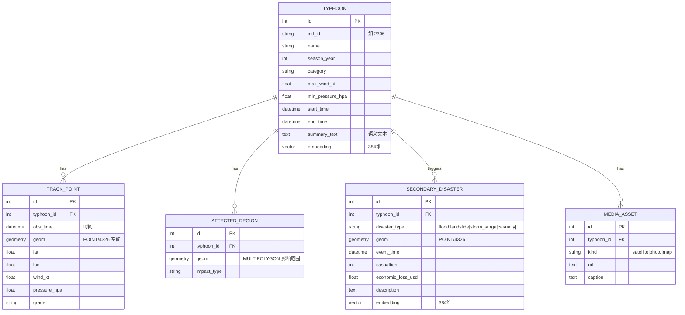

# 知识库数据结构定义 (Knowledge Base Data Structure) — 报告 1-3 / 1-4 / S1-1

以 SQLAlchemy ORM 数据库对象定义（见 `backend/models.py`），每张表兼具
**空间/时间特征列**（PostGIS `geom` + 时间戳）与**语义特征列**（pgvector `embedding`）。

## ER 关系

## 元数据 / 语义计算设计 (Metadata for Semantic Computing)

每个「知识单元」(台风、灾害事件) 由结构化元数据生成一段**可读多语言描述**
(`typhoon_summary()` / `disaster_summary()`，见 `backend/services/embedding.py`)，
再由多语言模型 `paraphrase-multilingual-MiniLM-L12-v2` 映射为 **384 维向量**，
JP/EN/CN 共享同一语义空间。检索时把自然语言查询投影到同一空间，用余弦距离做
**意味联想选择**——即课程 Coral / 意味計算 的工程实现。

> 已离线验证跨语言语义一致性：
> "severe flooding typhoon" 与 日文「洪水と土砂災害をもたらした台風」余弦相似度 ≈ **0.82**，
> 与中文「造成严重洪水和滑坡的强台风」≈ **0.73**，与无关句「a quiet day at the beach」≈ **0.10**。

## 数据示例 (Data Example — 记述内容 1-3)

来自 IBTrACS 2023 的真实解析结果（`--preview` 验证）：

| intl_id | name | year | category | max_wind_kt | min_pres | 轨迹点数 |
|---|---|---|---|---|---|---|
| 2321 | Mawar | 2023 | TY5 | 165 | 891 | 133 |
| 2333 | Doksuri | 2023 | TY4 | 130 | 928 | 87 |
| 2335 | Khanun | 2023 | TY4 | 125 | 924 | 133 |
